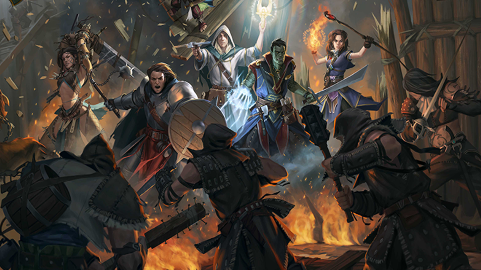

Erzählspiel
===========

Erzählspiel means "narrative game" or "storytelling game" in German.

This is a rules-light, universal tabletop roleplaying game that follows the ethos of the FKR (*Free Kriegsspiel Roleplaying*) of **"Play Worlds, not Rules"**.

This means that the focus should be put into making a believable (but not necessarily "realistic") setting and simulation of its internal rules instead of getting bogged down in specific mechanics and procedures. Players should interpret their characters as living persons inside this world and make decisions based on the context, their backgrounds and tools at hand. the Game Master should run the world sincerelly and impartially, as a neutral referee.

   art © `Akim Kaliberda <https://www.artstation.com/artwork/NzDk5>`_

In order to play, you will need at least two six-sided dice (preferrably a pair per player), writing implements and some sheets of paper in which to take notes and write character skills, items and conditions.

The GM will most likely peruse one of the Worlds and Scenarios provided in this site or document, as a guide to kickstart a gaming session (or multiple ones) of Erzählspiel.

.. toctree::
   :caption: Rules
   :hidden:

   pages/basicrules
   pages/opposition
   pages/principles
   pages/optionalrules
   pages/about

.. toctree::
   :caption: Worlds
   :hidden:

   pages/generic
   pages/dyingsun
   pages/galaxyfaraway
   pages/riseofthemachines
