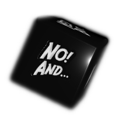
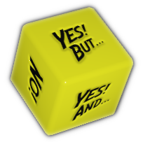
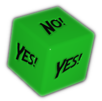
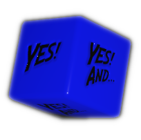
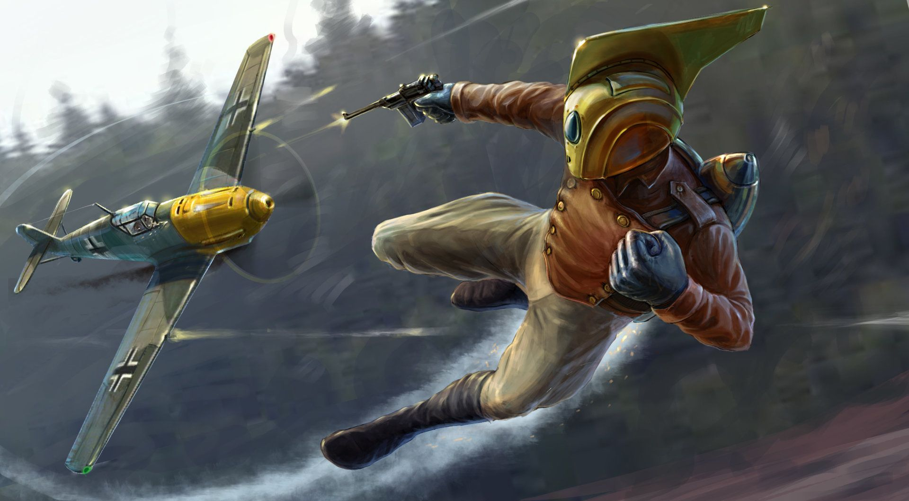
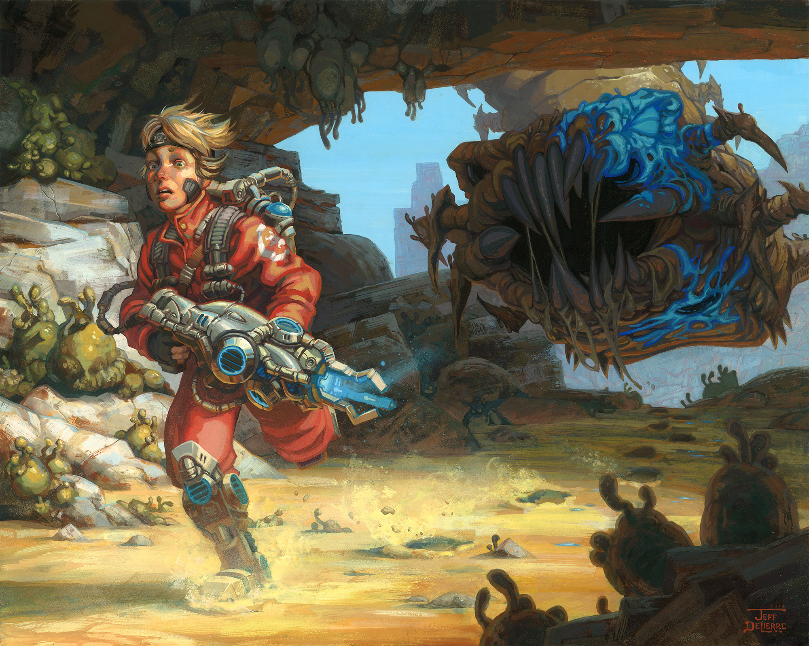
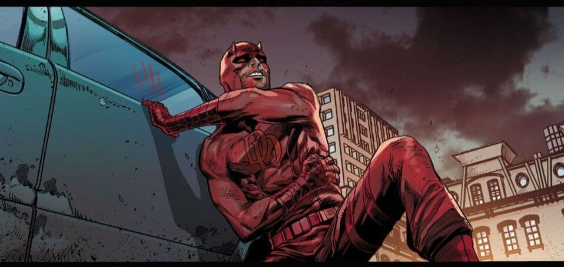
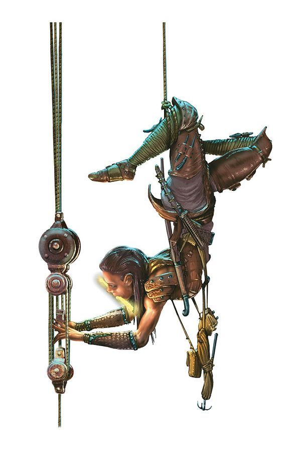

.. |reddie| image:: ../_static/images/red-die.png
   :height: 35px
   :align: bottom

Basic Rules
===========

Players interpret Characters (AKA *Player-Characters*, or "PCs").

The *Game Master* ("GM") interprets the rest of the world and all *Non-Player-Characters* ("NPCs").

.. _action-resolution:

Action Resolution
-----------------

   art © `Alex Mordovets <https://aem.artstation.com/projects/dyQzJ>`_

The game is a conversation. Players take turns to describe what their characters do. Then the GM declares if the action...

- just **happens** as described and what's the outcome
- is **impossible**, or what extra steps would be required
- has a **cost**, that the character must pay or suffer in order to perform the action
- presents a :hoverxref:`risk <risk>`, that the player must avoid before continuing (:hoverxref:`dice roll <rolling-the-dice>`)
- has an **uncertain** outcome, and a failure state is interesting (:hoverxref:`dice roll <rolling-the-dice>`)

.. _rolling-the-dice:

Rolling the dice
~~~~~~~~~~~~~~~~

If there is :hoverxref:`risk <risk>` or **uncertainty** and the player decides to move forward [#]_, the GM :hoverxref:`asserts their odds <interpret-the-odds>` of success and asks the player to roll a specific :hoverxref:`Narrative Die <narrative-dice>`:

.. [#] The player must be willing to take the risk before rolling the dice. They always have the option to back down and choose another course of action.

Roll |yellowdie| by default, when the odds are 50/50.

Roll |greendie| If you have **Advantage** for an action, from your character traits, skills, items or other external circumstances.

Roll |bluedie| If you have **Overwhelming Advantage** (because of cumulative Advantages, or by comparison of power levels, skill difference, item superiority, and such).

Roll |reddie| If you have **Disadvantage** from any condition, hindrance or other external circumstances.

Roll |blackdie| if you have **Overwhelming Disadvantage** (because of cumulative Disadvantages or negative conditions, or by comparison of power levels, skill difference, item superiority, and such). 

.. csv-table:: Dice roll outcomes
 :widths: 10, 90

 "YES! AND...", "You achieve what you intended with greater effect, or another thing beneficial to you also happens."
 "YES!", "You achieve what you intended to do."
 "YES! BUT...", "You are successful in what you tried to do, but to a certain degree, or another thing detrimental to you also happens."
 "NO! BUT...", "You failed at what you were trying to achieve, but it’s not too bad, or another thing beneficial to you also happens."
 "NO!", "You failed at what you were trying to do."
 "NO! AND...", "You failed at what you were trying to do, and it’s even worse, or another thing detrimental to you also happens."

.. _descriptors:

Descriptors
-----------

Descriptors are narrative truths that characters, obstacles or even the scene could have. 

These can be aspects or traits that give some sort of *narrative permission* (For example, a character with ``Wings`` would be able to fly, while others that don't have that Descriptor wouldn't be able to. Another character might have an ``Axe`` that would let them chop down a tree.). 

They could also give **Advantage** or **Disadvantage** to certain actions (For example, a character with the Descriptor ``Strong`` would have **Advantage** when trying to lift something heavy, while a character with the Descriptor ``Injured Leg`` would have **Disadvantage** when trying to run).

.. _interpret-the-odds:

Interpreting the Odds
---------------------

The GM interprets the context of the narrative and any :hoverxref:`Descriptor <descriptors>` that is in play (and could alter the odds of the action), concluding whether the character has Advantage or Disadvantage.

Some game mechanics might say they give "Advantage" or "Disadvantage" in specific situations. Other things like :hoverxref:`Descriptors <descriptors>` or :hoverxref:`Conditions <conditions>` usually impose Advantage or Disadvantage to certain actions.

Some GMs like to tally each and every one of the Descriptors, Conditions or other situations in play that could alter the odds, subtracting positives from negatives. Others like to eyeball it and infer whether there is match (50/50) of if the scales are tipped one way or the other (Advantageous or Disadvantageous for the character initiating the action).

Whichever the case, the GM only defines which die the player must :hoverxref:`roll <rolling-the-dice>`. The player can decide to move forward with the action with those odds, or back down and try something else. 

.. _risk:

Risk
----

   art © `Jeff Delierre <https://www.infectedbyart.com/contestpiece.asp?piece=3422>`_

A risk can be anything from a narrative consequence (something bad happens, the situation worsens, etc), a negative :hoverxref:`Condition <conditions>` that the character receives, or in some dire situations, outright death. GMs must state clearly what the risk is before the dice are rolled.

Avoiding Risk
~~~~~~~~~~~~~

The best way to avoid a risk is to try another course of action. If that's not possible and/or the player still wants to move forward with that action, then they would suffer varying degrees of risk in the form of Conditions (see :hoverxref:`Resisting Conditions <resisting-conditions>`).

.. _conditions:

Conditions
----------

   art © `Marco Checchetto <https://www.instagram.com/mchecc18>`_

**Conditions** are negative *Descriptors* a character might receive from external sources like damage or other hindrances. They usually give **Disadvantage** for related action rolls.

Condition **Slots** are limited; a character can have only one *Mild*, *Moderate* and *Severe* Condition. Gaining one in a slot already filled increases it to the next tier. If they don’t have empty slots, they are :hoverxref:`Taken Out <taken-out>` (out of action, without a say in their fate).

Examples: ``Mild laceration``, ``Moderate Embarrassment)``, ``Severe Internal Bleeding)``, ``Stunned (Mild)``

Conditions **Recover** over time after beginning some sort of appropriate treatment. As a rule of thumb, *Mild* Conditions recover after a few minutes or hours, *Moderate* ones recover after a few days, and *Severe* ones recover after weeks or months.

The different results on a die roll can be used to know what type of Condition you apply or receive:

.. _applying-conditions:

.. container:: applying-conditions

   .. csv-table:: Applying Conditions
   :widths: 30, 70

   "YES! AND...", "*Severe* Condition applied"
   "YES!", "*Moderate* Condition applied"
   "YES! BUT...", "*Mild* Condition applied"
   "any NO", "No Condition applied"

.. _resisting-conditions:

.. container:: resisting-conditions

   .. csv-table:: Resisting Conditions
   :widths: 30, 70

   "any YES", "No Condition received"
   "NO! BUT...", "*Mild* Condition received"
   "NO!", "*Moderate* Condition received"
   "NO! AND...", "*Severe* Condition received"

.. _taken-out:

Taken Out
~~~~~~~~~

Being **Taken Out** [#]_ usually means losing the ability to stay in play with the agency to alter the world around them. This could be represented in different ways, depending on the context of the situation; exhausted, beffudled, K.O.d, or even dead.

.. [#] If a character is **Taken Out** for long periods of time (or forever, if they died), their player should make a new character to introduce ASAP. Favor inclusion and fun over realism and rules. You might meet a new ally in the next room, promote a NPC to PC, or jump forward in time to recruiting a new teammate.

Difficulty
----------

   art © Fantasy Flight Games

If the GM wants to increase or decrease the difficulty of an action, they can do so by declaring a *Descriptor* that affects the action, and changes the die the player must roll, thus changing their :hoverxref:`odds of success <narrative-dice-probabilities>` (For example, changing the die from |yellowdie| to |reddie| changes the chance of getting any YES from 50% to 33%). 

Alternatively, the GM can just say that the action is "easier than normal" (and increase the die the player would roll), or that is "harder than normal" (and decrease the die the player would roll).
