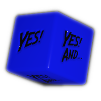

.. |blackdie| image:: ../_static/images/black-die.png
   :height: 35px
   :align: bottom

.. |reddie| image:: ../_static/images/red-die.png
   :height: 35px
   :align: bottom

.. |yellowdie| image:: ../_static/images/yellow-die.png
   :height: 35px
   :align: bottom

.. |greendie| image:: ../_static/images/green-die.png
   :height: 35px
   :align: bottom

Dice
====

.. _narrative-dice:

Narrative Dice
--------------

It is recommended to use the **Narrative Dice** for a more immersive and faster experience. These are custom six-sided dice of different colors, with text like "YES!", "NO!", "YES, AND...", "NO, BUT...", etc. 

.. rst-class:: center-aligned

.. csv-table:: 

   "|blackdie|", "|reddie|", "|yellowdie|", "|greendie|", "|bluedie|"
   "Black Die",  "Red Die", "Yellow Die", "Green Die", "Blue Die"

.. _narrative-dice-probabilities:

.. container:: narrative-dice-probabilities

   .. rst-class:: center-aligned

   .. csv-table:: Narrative Dice Faces and Probabilities
      :widths: 10, 18, 18, 18, 18, 18

      "", "|blackdie|", "|reddie|", "|yellowdie|", "|greendie|", "|bluedie|"
      "6", "YES! BUT...", "YES!", "YES! AND...", "YES! AND...", "YES! AND..."
      "5", "NO! BUT...",  "YES! BUT...",  "YES!",  "YES!",  "YES! AND..."
      "4", "NO!",  "NO! BUT...",  "YES! BUT...",  "YES!",  "YES!"
      "3", "NO!",  "NO!",  "NO! BUT...",  "YES! BUT...",  "YES!"
      "2", "NO! AND...",  "NO!",  "NO!",  "NO! BUT...",  "YES! BUT..."
      "1", "NO! AND...",  "NO! AND...",  "NO! AND...",  "NO!",  "NO! BUT..."
      "Success Chance", "16%", "33%", "50%", "66%", "84%"

Virtual Narrative Dice
~~~~~~~~~~~~~~~~~~~~~~

TODO

Building your own custom Narrative Dice
~~~~~~~~~~~~~~~~~~~~~~~~~~~~~~~~~~~~~~~

TODO

.. _regular-dice:

Regular six-sided dice
----------------------

TODO