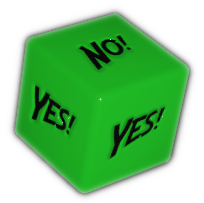

.. |blackdie| image:: ../_static/images/black-die.png
   :height: 35px
   :align: bottom

.. |reddie| image:: ../_static/images/red-die.png
   :height: 35px
   :align: bottom

.. |yellowdie| image:: ../_static/images/yellow-die.png
   :height: 35px
   :align: bottom

.. |bluedie| image:: ../_static/images/blue-die.png
   :height: 35px
   :align: bottom

Dice
====

.. _narrative-dice:

Narrative Dice
--------------

It is recommended to use the **Narrative Dice** for a more immersive and faster experience. These are custom six-sided dice of different colors, with text like "YES!", "NO!", "YES, AND...", "NO, BUT...", etc. 

.. rst-class:: center-aligned

.. csv-table:: 

   "|blackdie|", "|reddie|", "|yellowdie|", "|greendie|", "|bluedie|"
   "Black Die",  "Red Die", "Yellow Die", "Green Die", "Blue Die"

.. _narrative-dice-probabilities:

.. container:: narrative-dice-probabilities

   .. rst-class:: center-aligned

   .. csv-table:: Narrative Dice Faces and Probabilities
      :widths: 10, 18, 18, 18, 18, 18

      "", "|blackdie|", "|reddie|", "|yellowdie|", "|greendie|", "|bluedie|"
      "6", "YES! BUT...", "YES!", "YES! AND...", "YES! AND...", "YES! AND..."
      "5", "NO! BUT...",  "YES! BUT...",  "YES!",  "YES!",  "YES! AND..."
      "4", "NO!",  "NO! BUT...",  "YES! BUT...",  "YES!",  "YES!"
      "3", "NO!",  "NO!",  "NO! BUT...",  "YES! BUT...",  "YES!"
      "2", "NO! AND...",  "NO!",  "NO!",  "NO! BUT...",  "YES! BUT..."
      "1", "NO! AND...",  "NO! AND...",  "NO! AND...",  "NO!",  "NO! BUT..."
      "Success Chance", "16%", "33%", "50%", "66%", "84%"

Virtual Narrative Dice
~~~~~~~~~~~~~~~~~~~~~~

If you want to use the Narrative Dice but don't have physical ones, you can use the `Virtual Narrative Dice <https://tinyurl.com/NarrativeDice>`_ implemented in `ddice.com <http://dddice.com>`_. It allows you to roll the dice virtually and see the results in a similar way to the physical dice.

You can use them while playing online or even in person, if you prefer not to carry the physical dice around.

Building your own custom Narrative Dice
~~~~~~~~~~~~~~~~~~~~~~~~~~~~~~~~~~~~~~~

If you want to create your own custom Narrative Dice, you can use blank six-sided dice and write your own phrases on them. Use the :hoverxref:`above table <narrative-dice-probabilities>` that lists the faces of each die color as reference.

There are hobby stores and online retailers that sell blank six-sided dice (white or of different colors). You can use a permanent marker or paint to write the phrases you want on each face of the dice.

You can also use `this image <../_static/images/dice-faces-stickers.png>`_ with all faces (black or white) and print it on adhesive paper, then cut and stick it on blank dice.

.. _regular-dice:

Regular six-sided dice
----------------------

An alternative way to roll in Erzählspiel is to use **regular six-sided dice (d6)** instead of the Narrative Dice. In this case, the GM will need to interpret the results of the d6 rolls and translate them into the narrative outcomes that the Narrative Dice would provide.

.. csv-table:: Six-sided die results
 :widths: 10, 20, 90

 "6", "YES! AND...", "You achieve what you intended with greater effect, or another thing beneficial to you also happens."
 "5", "YES!", "You achieve what you intended to do."
 "4", "YES! BUT...", "You are successful in what you tried to do, but to a certain degree, or another thing detrimental to you also happens."
 "3", "NO! BUT...", "You failed at what you were trying to achieve, but it’s not too bad, or another thing beneficial to you also happens."
 "2", "NO!", "You failed at what you were trying to do."
 "1", "NO! AND...", "You failed at what you were trying to do, and it’s even worse, or another thing detrimental to you also happens."

Roll 1d6 by default, when the odds are 50/50. 

If a character has **Advantage** for an action, the player rolls two d6 and takes the higher result. If they have **Overwhelming Advantage**, they roll three d6 and take the highest. 

If they have **Disadvantage**, they roll two d6 and take the lower result, and for **Overwhelming Disadvantage**, they roll three d6 and take the lowest.

.. figure:: ../_static/images/Erzahlspiel-d6-odds-chart.png

  probabilities for d6 rolls
