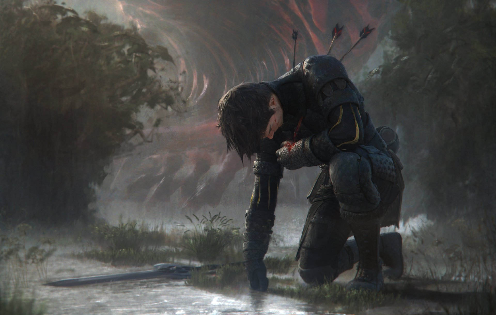

Optional Rules
==============

This is a collection of advanced rules and procedures that are by no means necessary to run a game of Erzählspiel, but can be added as needed.

.. figure:: ../_static/images/rpg-image-5.jpg

   art © `Celia Lowenthal <https://www.celialowenthal.com/>`_

.. _fate-die:

Fate Die 
--------

When the GM doesn't know something and instead of arbitrarily adjudicating for it, they want to leave it to the fates, they can roll 1d6 [#]_, in which a low result is bad for the PCs, and high is good.

.. [#] You can use a larger dice (like a d8, d10, d12, etc) but maintain the same range results if you want to tweak the odds towards less chance of trouble or signs of it.

For example:

- **1-2**: trouble
- **3-4**: signs of trouble
- **5-6**: Everything's fine

Or use it to answer a YES/NO question, i.e.: Does the PC run out of ammo? 1-2: Yes; 3-4: No but there's only 1 or 2 bullets left; 5-6: Not yet, plenty to go.

or...

Do the guards notice the PCs? 1-2: Yes, they sound the alarm!; 3-4: No, but they are suspicious, moving to investigate; 5-6: Not at all, the PCs are safe for now.

.. _granular-bonuses:

Granular Bonuses
----------------

**Granular Bonuses** mean that, when :hoverxref:`Rolling the dice <rolling-the-dice>`, instead of only gaining +1 for being Skilled and +1 for having a relevant Item, these could be bonuses of +2, +3, etc.

.. _basic-granular-bonuses:

Basic Granular Bonuses
~~~~~~~~~~~~~~~~~~~~~~

Basic Granular Bonuses can be +1/+2/+3 [#]_. 

.. [#] Warning! The main problem (mechanically speaking) about this Option is that a +3 is already a big modifier in a 2d6 dice roll. If you combine both Skills and Items in this way (for a max of +6), action rolls would become impossible to fail in most scenarios. It is recommended that you use this Optional Rule sparingly, or cap any roll modifiers at +3 max.

- **Skills**: Characters can be *Skilled* at something (+1), or an *Expert* (+2), or even a *Master* (+3).
- **Items**: Items that Characters have can be *Mundane* (+1), *Special* or *Masterwork* (+2), or even *Unique* or *Legendary* (+3).

.. _expanded-granular-bonuses:

Expanded Granular Bonuses
~~~~~~~~~~~~~~~~~~~~~~~~~

Expanded Granular Bonuses can be +1/+2/+3/+4/+5 [#]_. 

.. [#] The Expanded Granular Bonuses are better suited for larger ranges of dice rolls, like when using 3d6, 1d20, etc. They offer more progression between each step, and cause a greater effect on the extremes. If you combine Skill and Item bonuses this way, you might reach a +10 bonus (although that would be rare, the average is +3 to +5).

- **Skills**: Characters skill tiers are *dabbler* (+1), *adept* (+2), *expert* (+3), *veteran* (+4), or *master* (+5).
- **Items**: Items that Characters have can be *mundane* (+1), *uncommon* (+2), *masterwork* (+3), *rare* (+4) or *legendary* (+5).

.. _criticals:

Criticals
---------

Critical Successes
~~~~~~~~~~~~~~~~~~

There are two options for Critical Successes (GMs can use either or both at their games):

- When rolling the dice, if the result is a **natural 12** (i.e. the two dice show a total of 12, regardless of any modifiers), this is a **Critical Success**.
- If the result (after applying modifiers) is **12 or more**, this is a **Critical Success**.

A Critical Success means that the Character not only achieves their intended outcome, but also does so in a spectacular way, or with some additional positive effect. The GM helps interpret the exact details and benefits.

Critical Failures
~~~~~~~~~~~~~~~~~

There are two options for Critical Failures (GMs can use either or both at their games):

- When rolling the dice, if the result is a **natural 2** (i.e. the two dice show a total of 2, regardless of any modifiers), this is a **Critical Failure**.
- If the result (after applying modifiers) is **2 or less**, this is a **Critical Failure**.

A Critical Failure means that the Character not only fails at their intended outcome, but also suffers some additional negative effect. The GM helps interpret the exact details and consequences.

.. _conditions:

Conditions
----------

   art © `Enora <https://www.artstation.com/artwork/8BgvG/>`_

*Conditions* are negative effects that characters receive (each gives -1 to related rolls [#]_ in which the Condition might affect the outcome negatively). They can be *Mild*, *Moderate* or *Severe*, and a character can only have one of each type. If they receive a Condition of a type they already have, they gain a new one from a higher tier. If they can’t, they are :hoverxref:`Taken Out <taken-out>`. Conditions take time and some sort of healing process to recover; the time and effort required depends on their severity (hours, days, weeks).

.. [#] Alternatively, consider having *Mild* Conditions give a -1, *Moderate* Conditions impose a -2, and *Severe* Conditions cause a -3.

Applying Conditions
~~~~~~~~~~~~~~~~~~~

When Applying Conditions by attacking or somehow affecting an adversary, a **PARTIAL SUCCESS** causes a *Mild* Condition, a **SUCCESS** causes a *Moderate* one, and a **CRITICAL SUCCESS** causes a *Severe* one.

Resisting Conditions
~~~~~~~~~~~~~~~~~~~~

When Resisting Conditions from a negative source, a **SUCCESS** avoids it entirely, a **PARTIAL SUCCESS** begets a *Mild* Condition, a **FAILURE** begets a *Moderate* one, and a **CRITICAL FAILURE** begets a *Severe* one.

.. _clocks:

Clocks
------

Progress can be tallied for any situation that involves some sort of timer or level of advancement, with the help of **“Clocks”**. 

.. figure:: ../_static/images/rpg-image-8.png

A Clock is usually drawn in 4, 6, 8 or 10 segments (like a circle with pizza slices). When a PC makes progress, the GM marks a segment. When all are marked, the situation that was timed comes to happen. 

Depending on the situation, segments could be marked automatically when something happens in the fiction, or progress could require a dice roll. In those cases, A PARTIAL SUCCESS marks 1 segment; a SUCCESS marks 2 segments; a CRITICAL SUCCESS marks 3 segments.

Other Dice Systems
------------------

.. _3d6:

3d6
~~~

Instead of rolling 2d6 as per the :hoverxref:`basic dice rolling rules <rolling-the-dice>`, roll **3d6** and add the results for a total between 3 and 18 [#]_, ± modifiers:

.. [#] This is a more "bell curve" style of rolling, where the average result is 10.5, and the extremes (3 and 18) are very unlikely to happen. With more granular results you can apply more nuanced modifiers, just like in the Granular Bonuses section above.

- add +1 [#]_ if your character has a relevant Skill,
- add +1 if your character has a relevant Item, 
- add +1 if *helped* by circumstances, and +1 if *helped* by someone else (but they share any risk or consequence).
- subtract -1 for any relevant :hoverxref:`hindrance <hindrances>` or :hoverxref:`Condition <conditions>` that affects your character.

.. [#] Use +1 if using the base rules; +1 to +3 if using **Basic Granular Bonuses**; +1 to +5 if using **Expanded Granular Bonuses**.

Then check the total :

- a 9 or less is a **FAILURE**. Suffer full risk and/or don't get what they intended to do.
- a 10 to 13 is a **PARTIAL SUCCESS**. They achieve the intended outcome but partially, and/or suffer a lesser version of the risk.
- a 14 or more [#]_ is a **SUCCESS**. They get what they wanted, and avoid any risk.

.. [#] If using the optional rule for **Criticals**, with 3d6 either a natural 18 or a total of 18+ is a Critical Success. For Critical Failures, a natural 3 or a total of 3 or less is a Critical Failure. The GM decides which option to use at their games.

The range probabilities are very similar to rolling 2d6:

+-----------------+--------+--------+
|                 |  2d6   |  3d6   |
+=================+========+========+
|     FAILURE     | 41,67% | 37,49% |
+-----------------+--------+--------+
| PARTIAL SUCCESS | 41,67% | 46,29% |
+-----------------+--------+--------+
|     SUCCESS     | 16,67% | 16,21% |
+-----------------+--------+--------+

.. _d20:

d20
~~~

Instead of rolling 2d6 as per the :hoverxref:`basic dice rolling rules <rolling-the-dice>`, roll **1d20** [#]_ ± modifiers:

.. [#] This imposes a flat distribution (each number in the twenty-sided dice has the same probability of occurrence) which means that dice rolls will be more "swingy", and modifiers will have more impact on every action in the game.

- add +1 [#]_ if your character has a relevant Skill,
- add +1 if your character has a relevant Item, 
- add +1 if *helped* by circumstances, and +1 if *helped* by someone else (but they share any risk or consequence).
- subtract -1 for any relevant :hoverxref:`hindrance <hindrances>` or :hoverxref:`Condition <conditions>` that affects your character.

.. [#] Use +1 if using the base rules; +1 to +3 if using **Basic Granular Bonuses**; +1 to +5 if using **Expanded Granular Bonuses**.

Then check the total:

- a 9 or less is a **FAILURE**. Suffer full risk and/or don't get what they intended to do.
- a 10 to 16 is a **PARTIAL SUCCESS**. They achieve the intended outcome but partially, and/or suffer a lesser version of the risk.
- a 17 or more [#]_ is a **SUCCESS**. They get what they wanted, and avoid any risk.

.. [#] If using the optional rule for **Criticals**, with a d20 either a natural 20 or a total of 20+ is a Critical Success. For Critical Failures, a natural 1 or a total of 1 or less is a Critical Failure. The GM decides which option to use at their games.

The range probabilities are somewhat similar to rolling 2d6:

+-----------------+--------+--------+
|                 |  2d6   |  1d20  |
+=================+========+========+
|     FAILURE     | 41,67% |  45%   |
+-----------------+--------+--------+
| PARTIAL SUCCESS | 41,67% |  35%   |
+-----------------+--------+--------+
|     SUCCESS     | 16,67% |  20%   |
+-----------------+--------+--------+

.. _instinct-checks:

Instinct Checks
---------------

.. figure:: ../_static/images/rpg-image-15.jpg

   art © `Geoffroy Thoorens <https://www.artstation.com/djahal>`_

**Instinct Checks** are triggered in situations of extreme fear or pain, or life-threatening damage or danger. The result dictates if you can maintain your composure or are forced to act in a certain way. Roll and add modifiers (skills/items/abilities/etc) [#]_ that would help keeping your cool in the specific situation:

.. [#] The **Instinct Checks** rule works best with other *Optional Rules* like **Criticals** and **Conditions** (described above). 

.. csv-table:: Instinct Check Results

   "**CRITICAL FAILURE**. gain a *Severe* Condition like “very stressed” AND the GM picks your character’s behavior from  ``Fight``, ``Flight``, ``Freeze`` or ``Fawn``."
   "**FAILURE**. gain a *Moderate* Condition like “stressed”, AND choose a behavior from ``Fight``, ``Flight``, ``Freeze`` or ``Fawn``."
   "**PARTIAL SUCCESS**. Choose: gain a *Mild* Condition like “troubled”, OR choose a behavior from ``Fight``, ``Flight``, ``Freeze`` or ``Fawn``."
   "**SUCCESS**. You maintain your composure and are not adversely affected by the situation."
   "**CRITICAL SUCCESS**. You maintain your composure, and gain +1 for further **Instinct Checks** during the scene."

- **Fight**: lash out violently; attack anyone (friend or foe)
- **Flight**: Escape ASAP; distance from / block the danger
- **Freeze**: Become immobilized; in shock; unable to act
- **Fawn**: Surrender; yield; submit to (or ally with) the enemy

.. _attributes:

Attributes
----------

Character **Attributes** can be used instead of (or along with) **Skill** bonuses (Either the +1 from Skills in the base rules, or the extended ones from :hoverxref:`Expanded Granular Bonuses <expanded-granular-bonuses>`).

The **Attributes** are like the basic Characteristics of a character:

- **VIGOR**: strength, endurance, resistance.
- **DEXTERITY**: agility, speed, nimbleness.
- **PERCEPTION**: awareness, precision, senses.
- **INTELLIGENCE**: smarts, IQ, knowledge.
- **WILLPOWER**: focus, resolve, self-control.
- **CHARISMA**: personality, allure, influence.

The idea is that the player adds one of their character's Attribute modifiers to each roll. If it's not obvious, the GM tells the player which Attribute to use.

Attributes go from +1 to +3. In some games, GMs can also have characters with negative modifiers to represent characters that are bad at certain things (the usual there is to have Attributes go from -3 to +3, with an average of +0).

Magic Systems
-------------

Todo
