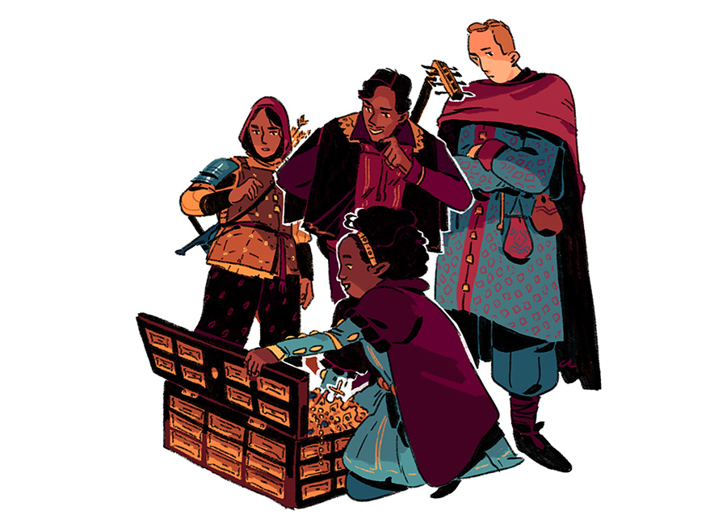
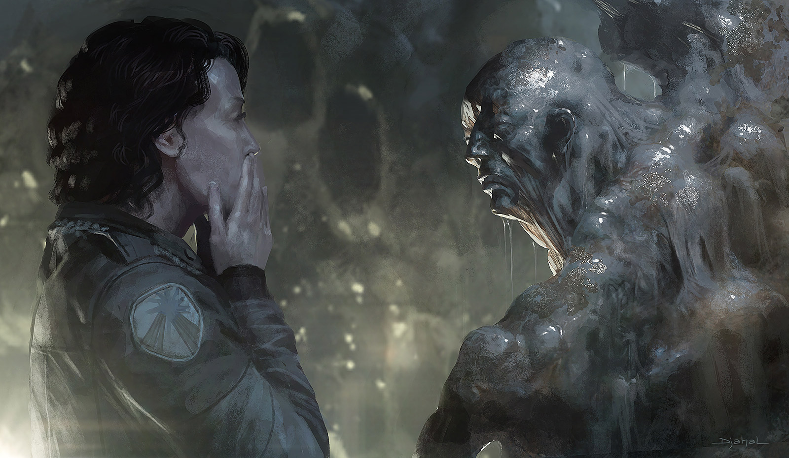

.. |blackdie| image:: ../_static/images/black-die.png
   :height: 35px
   :align: bottom

.. |reddie| image:: ../_static/images/red-die.png
   :height: 35px
   :align: bottom

.. |yellowdie| image:: ../_static/images/yellow-die.png
   :height: 35px
   :align: bottom

.. |greendie| image:: ../_static/images/green-die.png
   :height: 35px
   :align: bottom

.. |bluedie| image:: ../_static/images/blue-die.png
   :height: 35px
   :align: bottom

Optional Rules
==============

This is a collection of advanced rules and procedures that are by no means necessary to run a game of Erzählspiel, but can be added as needed.

   art © `Celia Lowenthal <https://www.celialowenthal.com/>`_

.. _fate-die:

Fate Die 
--------

When the GM doesn't know something and instead of arbitrarily adjudicating for it, they want to leave it to the fates, (*ran out of ammo? The Duke suspects them? Is it going to rain?*), formulate it as a YES/NO question and roll:

- |bluedie| ▶ if the answer is **Most assuredly** Yes.
- |greendie| ▶ if the answer is **Likely** to be Yes.
- |yellowdie| ▶ if the answer is **50/50** to be Yes.
- |reddie| ▶ if the answer is **Unlikely** to be Yes.
- |blackdie| ▶ if the answer is **Most assuredly** No.

.. _clocks:

Clocks
------

Progress can be tallied for any situation that involves some sort of timer or level of advancement, with the help of **“Clocks”**. 

A Clock is usually drawn in 4, 6, 8 or 10 segments (like a circle with pizza slices). When a PC makes progress, the GM marks a segment. When all are marked, the situation that was timed comes to happen. 

The GM can decide how much progress each event or action makes on a clock, or they can use the result of a dice roll for reference:

.. _making-progress:

.. container:: making-progress

   .. csv-table:: Making Progress
      :widths: 30, 70

      "YES! AND...", "Mark 3 progress segments"
      "YES!", "Mark 2 progress segments"
      "YES! BUT...", "Mark 1 progress segment"
      "any NO", "No progress made"

.. _descriptor-tiers:

Descriptor Tiers
----------------

Descriptors could have different tiers that represent their power level, quality or intensity. These tiers have no mechanical effect on their own, but they can be used by the GM to compare between characters' Descriptors when :hoverxref:`asserting the odds <interpret-the-odds>` to choose which die the player must roll.

+--------------+------------+---------------+------------+
|  Type / Tier |   Minor    |    Moderate   |    Major   |
+==============+============+===============+============+
|     Skill    |    Adept   |     Expert    |   Master   |
+--------------+------------+---------------+------------+
| Item Quality |   Mundane  |   Masterwork  |  Legendary |
+--------------+------------+---------------+------------+
|   Condition  |    Mild    |    Moderate   |   Severe   |
+--------------+------------+---------------+------------+

For example, a character with the Descriptor ``Martial arts Expert`` would have **Advantage** over a character with the Descriptor ``Martial arts Adept``. A character with the Descriptor ``Legendary Sword`` would have **Advantage** over a character with the Descriptor ``Masterwork Sword``. [#]_ 

.. [#] Some GMs like to give **Overwhelming Advantage** or **Overwhelming Disadvantage** when the Tier is two levels higher or lower than that of the opposition.

GMs are free to interpet these differences in tiers however they want, based on external circumstances or context, or disregard the level difference altogether when they deem unnecessary.

.. _instinct-checks:

Instinct Checks
---------------

   art © `Geoffroy Thoorens <https://www.artstation.com/djahal>`_

**Instinct Checks** are triggered in situations of extreme fear or pain, or life-threatening damage or danger. The result dictates if you can maintain your composure or are forced to act in a certain way. The GM will tell you the odds of resisting your instincts and which die to roll:

.. csv-table:: Instinct Check Results
 :widths: 10, 90

   "YES! AND...", "You maintain your composure and gain *Advantage* for further **Instinct Checks** during the scene."
   "YES!", "You maintain your composure and are not adversely affected by the situation."
   "YES! BUT...", "You maintain your composure, but suffer a *Mild* Condition like ``Troubled`` OR choose a behavior from **Fight**, **Flight**, **Freeze** or **Fawn**."
   "NO! BUT...", "You fail to maintain your composure: suffer a *Mild* Condition like ``Troubled`` AND choose a behavior from **Fight**, **Flight**, **Freeze** or **Fawn**."
   "NO!", "You fail to maintain your composure: suffer a *Moderate* Condition like ``Stressed`` AND choose a behavior from **Fight**, **Flight**, **Freeze** or **Fawn**."
   "NO! AND...", "You fail to maintain your composure: suffer a *Severe* Condition like ``Very Stressed`` AND the GM picks your character’s behavior from **Fight**, **Flight**, **Freeze** or **Fawn**."

- **Fight**: lash out violently; attack anyone (friend or foe)
- **Flight**: Escape ASAP; distance from / block the danger
- **Freeze**: Become immobilized; in shock; unable to act
- **Fawn**: Surrender; yield; submit to (or ally with) the enemy

Magic Systems
-------------

Creative Magic
~~~~~~~~~~~~~~

In this magic system, players and GM imagine magical effects and cast spells in a narrative way. There might be "Arcane Schools", "Elements", or "Spell lists", but those would be fictional constraints that simply limit what a particular spellcaster can do as an arcane effect; the following rules apply to all.

There are three ways to cast magic: **Subtle**, **Overt**, or **Massive**.

**Subtle magic** creates effects that are discreet and often go unnoticed by others. It allows the caster to manipulate the environment or influence others without drawing attention. The effects are often small-scale, temporary, and weak.

**Overt magic** is more obvious and can be easily perceived by others. It often involves dramatic gestures, incantations, or visible effects that make the magic's presence known. The effects are more powerful than subtle magic.

**Massive magic** is the most powerful and destructive form of magic. It can alter the environment on a grand scale, create catastrophic effects, or summon immense forces. This type of magic is often risky and can have unintended consequences.

Before Casting Magic, the player must decide if they are going to be *Subtle*, *Overt* or *Massive*. Sometimes the player just knows what effect they want to produce, and depending on their description, the GM can tell them if it is Subtle, Overt or Massive. Subtle magic sometimes doesn't even require a roll (if the effect is minor enough or there is no great risk or consequence for failing). Massive magic, on the other hand, not only requires a roll but also requires a more involved process that the GM will determine at the moment (**the GM sets 1 to 4 Conditions** that the spellcaster must fulfill before they roll):

.. csv-table:: Massive Magic conditions

   "It's going to take hours/days/weeks/months"
   "You must perform it at a special place/time"
   "First you must do [X] or get help from [X]"
   "The effect will be unreliable or limited"
   "You and your allies will risk danger from [X]"
   "You'll have to sacrifice or consume [X] to do it"

When the player rolls, consult the result depending on the type of magic below:

.. csv-table:: Casting Magic Results
   :widths: 10, 30, 30, 30
   :header: "Dice Result", "Subtle Magic", "Overt Magic", "Massive Magic"

   "YES! AND...", "the spell works with increased benefit or power", "the spell works with increased benefit or power", "the spell works without Magical Mishaps"
   "YES!", "the spell works as intended", "the spell works as intended", "the spell works as intended, but choose: you are ``Winded (Mild)`` or a **Minor Mishap** occurs"
   "YES! BUT...", "the spell works, but you are ``Winded (Mild)``", "the spell works, but choose: you are ``Winded (Mild)`` or a **Minor Mishap** occurs", "the spell works, but choose: you are ``Tired (Moderate)`` or a **Medium Mishap** occurs"
   "NO! BUT...", "the spell fails, but with no undesired effects or exhaustion", "the spell fails, but with no undesired effects or exhaustion", "the spell fails, and choose: you are ``Winded (Mild)`` or a **Minor Mishap** occurs"
   "NO!", "the spell fails", "the spell fails, but choose: you are ``Winded (Mild)`` or a **Minor Mishap** occurs", "the spell fails, but choose: you are ``Tired (Moderate)`` or a **Medium Mishap** occurs"
   "NO! AND...", "the spell fails, and choose: you are ``Winded (Mild)`` or a **Minor Mishap** occurs", "the spell fails, and choose: you are ``Tired (Moderate)`` or a **Medium Mishap** occurs", "the spell fails, and choose: you are ``Exhausted (Severe)`` or a **Major Mishap** occurs"

Magical Mishaps
^^^^^^^^^^^^^^^

.. _minor-mishaps:

**Minor Mishaps**

Roll d6 or choose:

1. You speak and write gibberish until rest.
2. You start glowing, attracting attention.
3. The weather worsens locally, following you around, until rest.
4. Something nearby spontaneously catches on fire.
5. Every sentient being in the vicinity gains a ``Disoriented (Mild)`` Condition.
6. An anomalous light beam triggers at your location; a magical beacon that attracts any arcane-attuned being.

.. _medium-mishaps:

**Medium Mishaps**

Roll d6 or choose:

1. One of your body parts or facial features changes into that of an animal (detrimental/awkward), until rest.
2. The spell targets a random, unwanted target.
3. The spell effect is much smaller/bigger than expected, to your detriment.
4. Your mind switches bodies with that of a nearby ally, until rest.
5. You lose the ability to understand any spoken word until rest.
6. One of your limbs is petrified (a ``Moderate`` Condition) until rest.

.. _major-mishaps:

**Major Mishaps**

Roll d6 or choose:

1. You become deaf or blind (a ``Severe`` Condition) until rest.
2. The spell does the opposite of the intended effect, to your detriment.
3. An Item you carry (or that of a nearby ally) is broken or spent and must be repaired or refilled.
4. A localized earthquake occurs: the ground cracks, structures collapse, people is hurt, etc. It lasts for 1 minute, complicating everyone with a ``Moderate`` Condition.
5. The area turns into an arcane nega-zone where no spells can be cast, for a year.
6. An entity of horror is summoned. It is angry and has no master.
