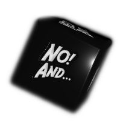
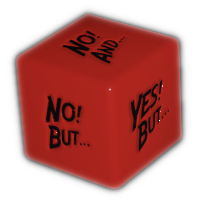

.. |yellowdie| image:: ../_static/images/yellow-die.png
   :height: 35px
   :align: bottom

.. |greendie| image:: ../_static/images/green-die.png
   :height: 35px
   :align: bottom

.. |bluedie| image:: ../_static/images/blue-die.png
   :height: 35px
   :align: bottom

Optional Rules
==============

This is a collection of advanced rules and procedures that are by no means necessary to run a game of Erzählspiel, but can be added as needed.

.. figure:: ../_static/images/rpg-image-5.jpg

   art © `Celia Lowenthal <https://www.celialowenthal.com/>`_

.. _fate-die:

Fate Die 
--------

When the GM doesn't know something and instead of arbitrarily adjudicating for it, they want to leave it to the fates, (*ran out of ammo? The Duke suspects them? Is it going to rain?*), formulate it as a YES/NO question and roll:

- |bluedie| ▶ if the answer is **Most assuredly** Yes.
- |greendie| ▶ if the answer is **Likely** to be Yes.
- |yellowdie| ▶ if the answer is **50/50** to be Yes.
- |reddie| ▶ if the answer is **Unlikely** to be Yes.
- |blackdie| ▶ if the answer is **Most assuredly** No.

.. _clocks:

Clocks
------

Progress can be tallied for any situation that involves some sort of timer or level of advancement, with the help of **“Clocks”**. 

.. figure:: ../_static/images/rpg-image-8.png

A Clock is usually drawn in 4, 6, 8 or 10 segments (like a circle with pizza slices). When a PC makes progress, the GM marks a segment. When all are marked, the situation that was timed comes to happen. 

The GM can decide how much progress each event or action makes on a clock, or they can use the result of a dice roll for reference:

.. _making-progress:

.. container:: making-progress

   .. csv-table:: Making Progress
      :widths: 30, 70

      "YES! AND...", "Mark 3 progress segments"
      "YES!", "Mark 2 progress segments"
      "YES! BUT...", "Mark 1 progress segment"
      "any NO", "No progress made"

.. _instinct-checks:

.. _descriptor-tiers:

Descriptor Tiers
----------------

Descriptors could have different tiers that represent their power level, quality or intensity. These tiers have no mechanical effect on their own, but they can be used by the GM to compare between characters' Descriptors when :hoverxref:`asserting the odds <interpret-the-odds>` to choose which die the player must roll.

+--------------+------------+---------------+------------+
|  Type / Tier |   Minor    |    Moderate   |    Major   |
+==============+============+===============+============+
|     Skill    |    Adept   |     Expert    |   Master   |
+--------------+------------+---------------+------------+
| Item Quality |   Mundane  |   Masterwork  |  Legendary |
+--------------+------------+---------------+------------+
|   Condition  |    Mild    |    Moderate   |   Severe   |
+--------------+------------+---------------+------------+

For example, a character with the Descriptor ``Martial arts Expert`` would have **Advantage** over a character with the Descriptor ``Martial arts Adept``. A character with the Descriptor ``Legendary Sword`` would have **Advantage** over a character with the Descriptor ``Masterwork Sword``. [#]_ 

.. [#] Some GMs like to give **Overwhelming Advantage** or **Overwhelming Disadvantage** when the Tier is two levels higher or lower than that of the opposition.

GMs are free to interpet these differences in tiers however they want, based on external circumstances or context, or disregard the level difference altogether when they deem unnecessary.

Instinct Checks
---------------

   art © `Geoffroy Thoorens <https://www.artstation.com/djahal>`_

**Instinct Checks** are triggered in situations of extreme fear or pain, or life-threatening damage or danger. The result dictates if you can maintain your composure or are forced to act in a certain way. The GM will tell you the odds of resisting your instincts and which die to roll:

.. csv-table:: Instinct Check Results
 :widths: 10, 90

   "YES! AND...", "You maintain your composure and gain *Advantage* for further **Instinct Checks** during the scene."
   "YES!", "You maintain your composure and are not adversely affected by the situation."
   "YES! BUT...", "You maintain your composure, but suffer a *Mild* Condition like ``Troubled`` OR choose a behavior from **Fight**, **Flight**, **Freeze** or **Fawn**."
   "NO! BUT...", "You fail to maintain your composure: suffer a *Mild* Condition like ``Troubled`` AND choose a behavior from **Fight**, **Flight**, **Freeze** or **Fawn**."
   "NO!", "You fail to maintain your composure: suffer a *Moderate* Condition like ``Stressed`` AND choose a behavior from **Fight**, **Flight**, **Freeze** or **Fawn**."
   "NO! AND...", "You fail to maintain your composure: suffer a *Severe* Condition like ``Very Stressed`` AND the GM picks your character’s behavior from **Fight**, **Flight**, **Freeze** or **Fawn**."

- **Fight**: lash out violently; attack anyone (friend or foe)
- **Flight**: Escape ASAP; distance from / block the danger
- **Freeze**: Become immobilized; in shock; unable to act
- **Fawn**: Surrender; yield; submit to (or ally with) the enemy

Magic Systems
-------------

TODO
